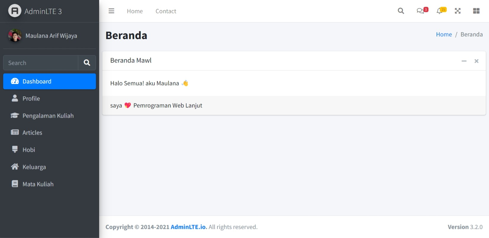
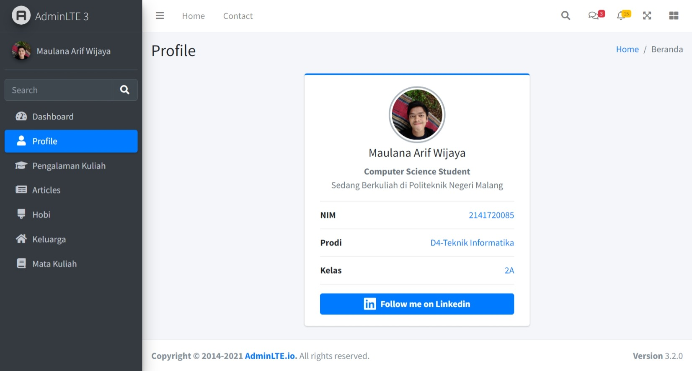
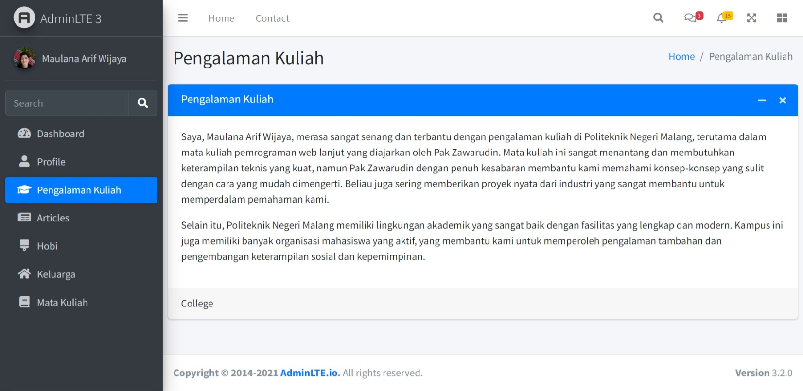
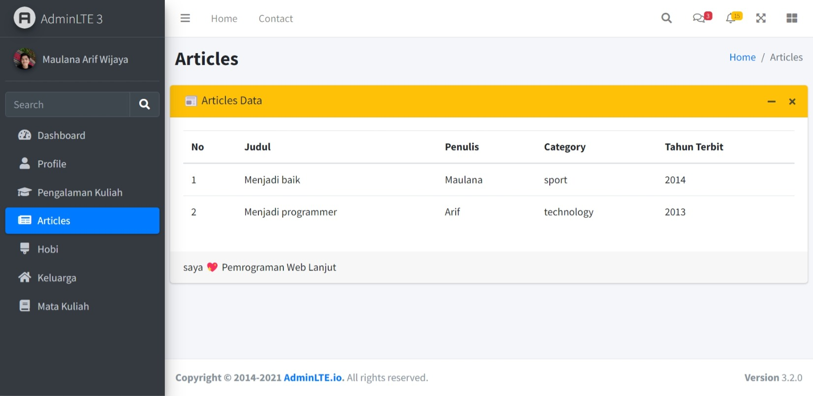
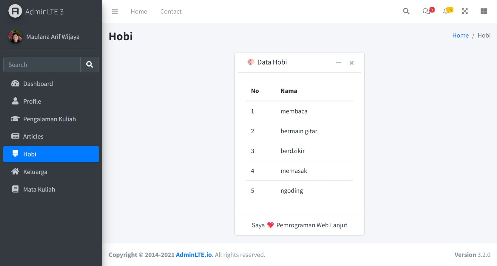
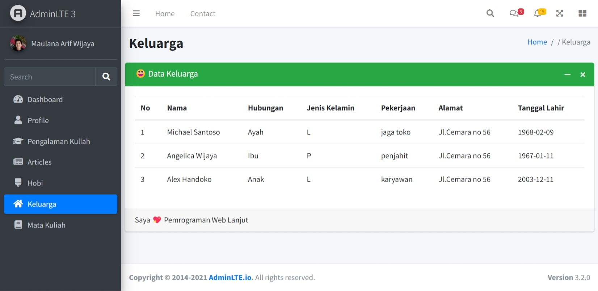
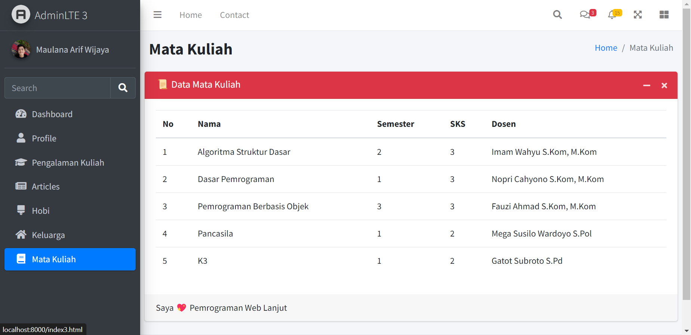

# Pemrograman Web Lanjut

Mata kuliah Pemrograman Web Lanjut adalah mata kuliah yang mempelajari tentang pengembangan aplikasi web dengan menggunakan framework Laravel. Pada mata kuliah ini, saya membuat suatu project laravel yang akan terus dikembangan selama satu tahun sebagai bahan ajar.

## Preview Project

